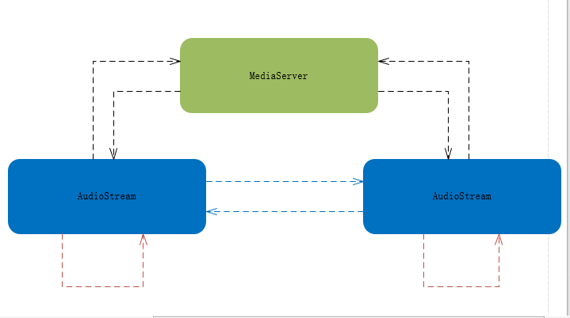

# pjsip-audio-stream
基于pjsip的简单音频通话

# 组成
- AudioStream：基于pjsip封装的音频推流/拉流客户端
- MediaServer：简单的UDP服务器，用于转发音频流

AudioStream客户端可以向指定地址发送RTP音频数据包（G711(PCMU)），同时接收播放指定端口上到来的RTP音频数据包。

- 本地端口和远程端口设置为同一个，远程ip地址设置为127.0.0.1本地回环地址，则自身推拉流（采集本地麦克风音频并发送到扬声器播放）
- 局域网不同终端指定IP即可互相推拉流
- 外网借助MediaServer可实现跨局域网推拉流

