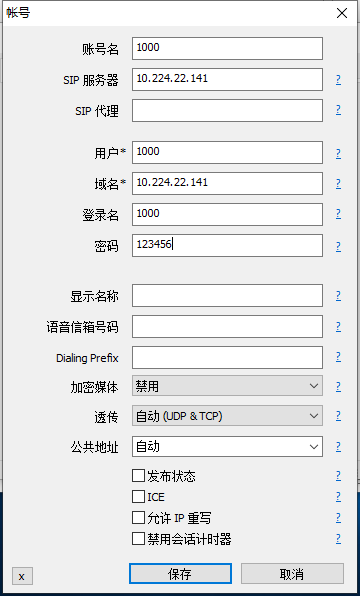

# centos7下安装freeswitch

## rpm安装（推荐）
[参考文档](https://freeswitch.org/confluence/display/FREESWITCH/CentOS+7+and+RHEL+7)

1. 安装
```
./install.sh
```

2. 启动
```
systemctl enable freeswitch.service
```

查看freeswitch是否启动

```
netstat -an | grep 5060
```

## 编译安装（不推荐）
[参考文档](https://wsonh.com/article/64.html)

# 常见问题

1. 如果运行freeswitch出现以下错误，是因为端口被占用了。
[root@localhost ~]# freeswitch
Cannot lock pid file /usr/local/freeswitch/run/freeswitch.pid.

解决办法：可以重启Linux或者关闭占用端口的进程。

2. 如果freeswitch启动成功，但是linphone注册不上。

解决办法：
```
# 查看防火墙状态
systemctl status firewalld.service
# 关闭防火墙
systemctl stop firewalld.service
# 取消防火墙开机启动
systemctl disable firewalld.service
```


3. centos默认网卡没有启动
```
vi /etc/sysconfig/network-scripts/ifcfg-ens33 # 修改ONBOOT=yes，并保存
sudo service network restart
ip addr # 可以看到ens33中的ip地址
```

# 客户端测试
FreeSWITCH使用make install安装完成后，默认就配置了1000~1019共20个账户，不用做任何其它配置，就可以开始我们的基本通话测试了，非常人性化。

- 查看freeswitch监听的ip地址，后面我们要用这个ip地址配置microsip
```
netstat -an | grep 5060
```

- 下载客户端

windows: [microsip](https://www.microsip.org/)

mac: [xlite](https://www.counterpath.com/x-lite-download/)

- 添加账户，Domain应该填写FreeSWITCH服务器的IP地址，Username可以填1000~1019其中一个，Password是1234，具体如图：



再不同机器上启动microsip登上不同账号可以互相呼叫


